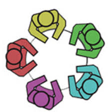
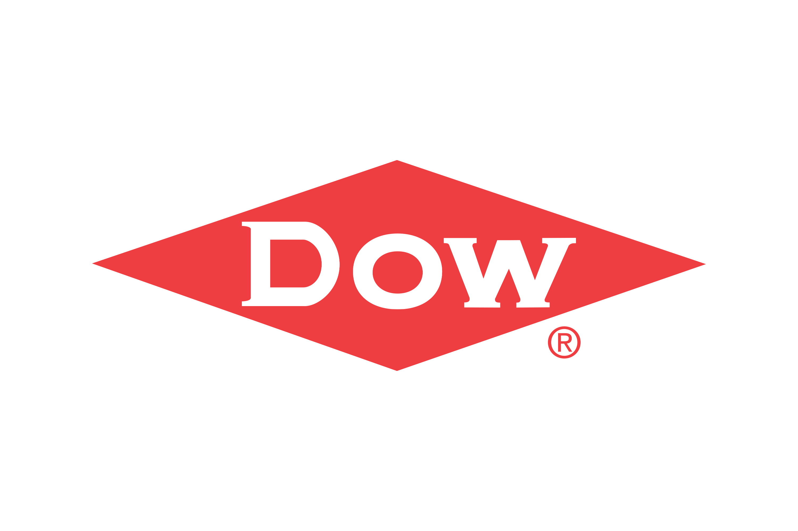
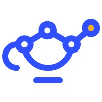

# I'm Kimaya 😄
**CS @ Purdue · Enterprise AI Intern @ Humana · Software Developer @ CATME · LLM Privacy Risks Research** 

[LinkedIn](https://www.linkedin.com/in/kimaya-deshpande-026452253/) · [Instagram](https://www.instagram.com/quark_brain/)

---

```
> kimaya --init
```

I build things at the intersection of AI systems and backend infrastructure — pipelines that have an impact, agents that follow through workflows, and successfully working code that I have spent sleepless nights on. I'm a CS student at Purdue with a focus on ML/AI and backend development, and I'm drawn to problems where the technical challenge and the real-world stakes are both high.

I am passionate about language models, privacy, and what it means to build technology that makes a difference.

---

```
> cat aim.txt
```

Right now I'm building multi-hop agentic pipelines for clinical data at Humana — where the output shapes how clinicians understand a patient's health trajectory. Accuracy isn't a stretch goal here; it's the baseline for anything that matters. I also research LLM privacy attacks at the Tech Justice Lab, because understanding what these models leak about people feels like the other side of the same coin.

---

```
> ls experiences/
```

| | Position | Company | Project Work |
|------|------|--------|-------|
| [](https://raw.githubusercontent.com/deshpank/deshpank/main/assets/humana.jpg) | Enterprise AI Intern | Humana | Multi-hop LangGraph agents for clinical vitals evaluation · Azure DevOps · Agile |
| [](https://raw.githubusercontent.com/deshpank/deshpank/main/assets/catme.jpg) | Software Developer | CATME | Backend dev in Perl + SQL · audit tracking system · Zendesk support engineering |
| [](https://raw.githubusercontent.com/deshpank/deshpank/main/assets/techjusticelab.jpg) | Undergraduate Researcher | Tech Justice Lab | LLM profile inference attacks · AutoProfiler framework · privacy & de-anonymization research |
| [](https://raw.githubusercontent.com/deshpank/deshpank/main/assets/dow.png) | Student Developer | Dow × Data Mine | LIMS system · LangGraph Report Agent with RAG · DuckDB · FastAPI · Quarto visual reports |
|  [](https://raw.githubusercontent.com/deshpank/deshpank/main/assets/datagenie.jpg) | Software Intern | DataGenie AI | Multi-agent orchestration · n8n automation · agentic customer qualification workflows |

---

```
> ls projects/
```

| Project | What it does | Stack | Links |
|---------|-------------|-------|-------|
| **FlowFuel** 🏆 | Personalized nutrition + cycle tracking app — reverse-engineered Purdue Dining's menus, real-time AI meal recs | React, Node.js, Flask, Groq, RapidAPI | 🔗[devpost](https://devpost.com/software/flowfuel) · 🔗[repo](https://github.com/Ys876/Fuelflow) |
| **Dow LIMS + Report Agent** 📝 | Lab data management system + LangGraph RAG agent that converts chat histories into structured visual reports | Python, LangGraph, DuckDB, FastAPI, Quarto |  [repo](https://github.com/TheDataMine/f2025_s2026_wl_dow_agenticworkflow) |
| **Car Image Classifier** 🚗 | Inception V3 classifier studying how epoch count + batch size affect accuracy — deployed as a Flask web app | Python, TensorFlow, Flask, AWS, Docker | 🔗[notebook](https://colab.research.google.com/drive/1nSO0wWjsRw-fjkQPa_M1Yy3tC8rXYmpA) · 🔗[repo](https://github.com/kimaya-k/Car_Image_Classifier) |
| **Recipe Management System** 👩‍🍳 | Full-stack platform for small food businesses — auth, CRUD, ingredient scaling, cost management, YouTube integration | Java Spring Boot, MySQL, Thymeleaf | 🔗[repo](https://github.com/kimaya-k/Recipe_Manager) |
| **Chat Messaging Platform** 💭 | Multi-user chat system with real-time messaging, friend and block management, user auth, and profile customization | Java, Sockets, Swing | 🔗[repo](https://github.com/mattcling/Cs-180-Team-Project) |
| **UNIX Shell** 🐚 | Fully-featured shell interpreter — pipes, I/O redirection, subshells, tab completion, wildcard globbing, raw-mode line editor | C++, Flex, Bison | — |
| **Dynamic Memory Allocator** 💾 | Custom malloc from scratch — segregated free lists, boundary tag coalescing, thread safety, corruption detection | C, pthreads | — |


---

```
> cat skills.txt
```
**Languages**  


**ML / AI**  


**Web / Backend**  


**Databases**  


**Infra / Cloud**  


**LLM / Agents**  


---
**Languages**  


**ML / AI**  


**Web / Backend**  


**Databases**  


**Infra / Cloud**  


**LLM / Agents**  


```
> git log --oneline
```
[](https://github.com/ashutosh00710/github-readme-activity-graph)
